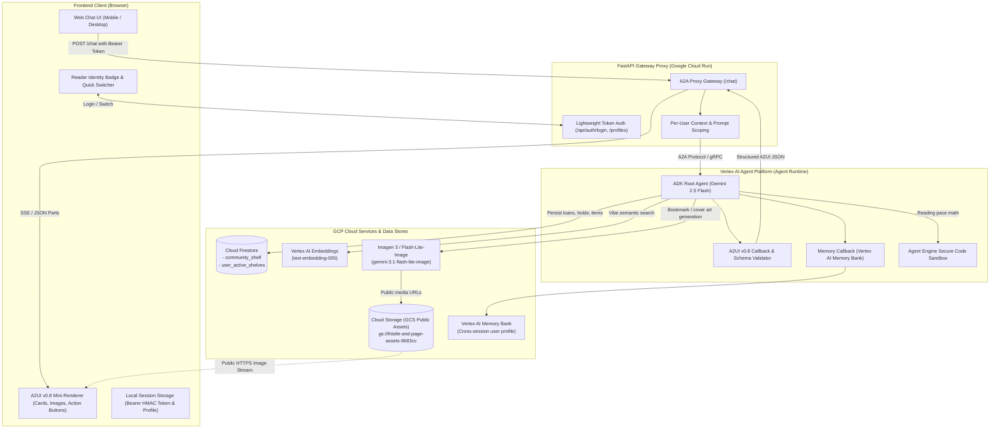

# 🌿 Thistle & Page — System Architecture & Design

**Unified San Mateo County Library & Neighborhood Peer-to-Peer Lending Copilot**

Live Application: [https://thistle-and-page-frontend-43484983729.us-central1.run.app](https://thistle-and-page-frontend-43484983729.us-central1.run.app)  
GitHub Repository: [https://github.com/Dhrishni/buildwithgemini-thistle-and-page](https://github.com/Dhrishni/buildwithgemini-thistle-and-page)

---

## 1. System Architecture Diagram

---

## 2. Core Subsystems & Components

### A. Client & User Identity Tier (Browser / Frontend)
- **Header Reader Badge**: Displays authenticated reader persona (e.g. `🌿 Elena R. (Baywood)`, `📖 Marcus T. (Hillsdale)`, `☕ Sarah K. (Burlingame)`).
- **Lightweight Token Auth**: Issues HMAC-SHA256 bearer tokens stored in browser `localStorage`, seamlessly passed in the `Authorization: Bearer <token>` header on every turn.
- **A2UI v0.8 Native Engine**: Displays interactive cards with zero boilerplate, live action buttons (`.a2btn`), material icons, and inline public image assets without HTML injection vulnerabilities.

### B. Gateway & Proxy Tier (Cloud Run)
- **Service**: `thistle-and-page-frontend` running FastAPI and Uvicorn.
- **Identity Scoping**: Resolves and validates incoming bearer tokens, extracts `user_id`, and enriches agent prompts with authenticated context:
  `[Authenticated Reader: Name (id: user_id, neighborhood: neighborhood)]`.
- **A2A Client**: Manages persistent conversation contexts (`context_id`) mapped per user to ensure isolated dialogue history across multiple users.

### C. Agent Reasoning & Tool Tier (Vertex AI Agent Engine)
- **Core LLM**: `gemini-2.5-flash` orchestrated via Google ADK (Agent Development Kit).
- **Tools**:
  1. `get_my_active_shelf`: Reads user-specific borrowed books and holds from Cloud Firestore scoped strictly to `user_id`.
  2. `request_neighbor_borrow`: Creates a peer loan between borrower and lender, recording due dates in Firestore.
  3. `search_catalog_and_neighborhood`: Multi-modal search matching exact titles and semantic reading vibes with distance filtering.
  4. `generate_item_image`: Generates custom bookmark artwork and cover imagery using `gemini-3.1-flash-lite-image` and uploads directly to public GCS.
  5. `calculate_reading_pace`: Assesses due-date feasibility and reading pace.
  6. `AgentEngineSandboxCodeExecutor`: Secure cloud execution sandbox for complex queue simulations and date calculations.

### D. Data & Storage Tier
1. **Google Cloud Firestore**:
   - `community_shelf`: Catalog of physical books and reading accessories offered by neighbors in San Mateo County.
   - `user_active_shelves`: Per-user active loans, library holds, due dates, and handoff instructions.
2. **Vertex AI Embeddings (`text-embedding-005`)**:
   - 768-dimensional dense vector embeddings providing cosine-similarity semantic search across books and mood vibes.
3. **Google Cloud Storage (GCS)**:
   - Bucket `gs://thistle-and-page-assets-9683cc` hosting generated book illustrations and bookmarks with public HTTPS endpoints.
4. **Vertex AI Memory Bank**:
   - Durable long-term memory capturing reader pace, active library cards, and walking/driving transit tolerances.

---

## 3. Data Flow & Security Model

1. **Zero GCP Credentials in Browser**: The browser speaks standard HTTPS/JSON with bearer tokens only to the Cloud Run proxy.
2. **Application Default Credentials (ADC)**: The Cloud Run proxy authenticates to Vertex AI Agent Platform using service account tokens refreshed per request.
3. **Session & Shelf Scoping**: No user can mutate or inspect another reader's active holds or borrowing schedule without explicit user ID matching in Firestore.
